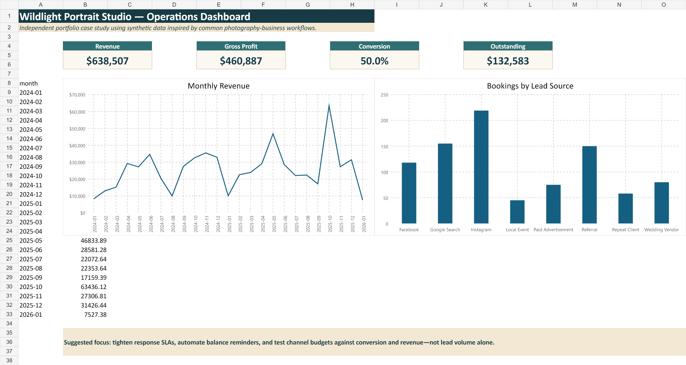

# Photography Business Analytics and Operations Dashboard

> **Independent portfolio case study using synthetic data inspired by common photography-business workflows.**

> “This independent portfolio project uses entirely synthetic data. It was created to demonstrate analytical, technical, documentation, and process-improvement skills commonly used in small-business analytics. It does not contain data from any real employer, client, or individual.”

## Overview

Wildlight Portrait Studio is a fictional photography business with booking, revenue, marketing, and payment information spread across disconnected files. This case study builds a clean reporting system and identifies opportunities to improve revenue, marketing efficiency, client retention, payment follow-up, and administrative workflows. The solution combines SQL, Python, R, Excel, Power BI planning, Tableau planning, and project-coordination documentation.



## Business problem and questions

The analysis evaluates package and service profitability, channel bookings and conversion, repeat behavior, booking value, cancellations and reschedules, seasonality, lead response and booking lag, outstanding balances, workflow bottlenecks, marketing allocation, and a simple revenue forecast. Definitions live in [`project_plan/data_dictionary.md`](project_plan/data_dictionary.md); the complete answers are in [`reports/findings.md`](reports/findings.md).

## Tools and analytical workflow

Python (pandas, NumPy, matplotlib, scikit-learn, sqlite3) generates and cleans the data, loads SQLite, calculates KPIs, produces separate charts, and exports dashboard tables. SQL demonstrates normalized design, constraints, CTEs, joins, windows, CASE-ready business logic, data-quality checks, and views. R independently validates revenue, segmentation, repeat behavior, and service comparisons. Excel provides nine usable tabs with formatted tables, filters, formulas/summary logic, conditional formatting, and native charts. Power BI and Tableau guides translate the same definitions into proposed dashboards.

`synthetic raw CSVs → validation/cleaning → normalized SQLite + booking-grain analytics → Python/R analysis → Excel and interactive BI project outputs → recommendations`

## Interactive dashboard deliverables

- **Power BI:** open [`powerbi/WildlightAnalytics.pbip`](powerbi/WildlightAnalytics.pbip) in Power BI Desktop. The validated PBIP/PBIR project contains a Web-connected semantic model, canonical DAX measures, five report pages, KPI cards, a revenue trend, and data-bound package, source, client, and payment visuals.
- **Tableau:** open [`tableau/Wildlight_Analytics.twbx`](tableau/Wildlight_Analytics.twbx) in Tableau Desktop or Tableau Public. The packaged workbook contains its synthetic CSV data, four worksheets, calculated fields, and an executive dashboard.
- **R Markdown:** open the rendered [`r/photography_business_findings.html`](r/photography_business_findings.html) or rerun [`r/photography_business_findings.Rmd`](r/photography_business_findings.Rmd). The report includes reproducible KPI calculations, six analytical graphics, findings, recommendations, and limitations.

## Key results from the generated dataset

| KPI | Result |
|---|---:|
| Revenue | $638,507 |
| Expenses | $177,620 |
| Gross profit | $460,887 |
| Profit margin | 72.2% |
| Average booking value | $857 |
| Lead-to-booking conversion | 50.0% |
| Repeat-client rate | 33.1% |
| Cancellation / rescheduling | 7.7% / 8.9% |
| Outstanding balance | $132,583 |
| Avg. response / inquiry-to-booking | 36.7 hours / 12.3 days |
| Session completion | 78.0% |

The synthetic dataset indicates that Wedding Collection leads revenue and modeled gross profit. Instagram contributes the most attributed bookings; Search and Referral are the next-largest sources. October–November and graduation season show demand spikes, while January is consistently softer. The analysis suggests tightening response SLAs and automating balance follow-up before pursuing additional volume.

## Repository map

- `data/`: seven raw files, cleaned tables, analytics extracts, and reproducible generator
- `sql/`: schema, loading notes, QA, exploratory/business queries, and reusable views
- `python/` and `r/`: cleaning, analysis, charts, forecast, validation, and segmentation
- `excel/`: professional workbook and build/use instructions
- `powerbi/` and `tableau/`: data-model, measure, calculated-field, layout, and drill guidance
- `project_plan/`: charter, stakeholders, requirements, risks, dictionary, and lessons learned
- `reports/`, `visuals/`, `tests/`: decision narrative, screenshots, and metric/data tests

## Run locally

```powershell
python -m venv .venv
.\.venv\Scripts\Activate.ps1
python -m pip install -r requirements.txt
python data\synthetic_data_generation\generate_data.py
python python\data_cleaning.py
python python\business_analysis.py
python python\exploratory_analysis.py
python python\forecasting.py
python python\export_dashboard_data.py
python -m pytest -q
```

The Excel workbook and rendered R Markdown report are usable without running code. Power BI uses Microsoft's source-controlled PBIP/PBIR/TMDL format rather than an opaque `.pbix`; Tableau is supplied as a packaged `.twbx` workbook.

## Skills demonstrated

Synthetic data design, data-quality controls, relational modeling, SQL analysis, Python/R analytics, forecasting, Excel reporting, BI requirements, KPI governance, business storytelling, risk management, and process improvement.

## Limitations and future improvements

This is synthetic booking-grain data with simplified attribution and modeled package costs. Two years are not enough for high-confidence forecasting, and package variable costs do not constitute full job costing. Future work could add campaign spend, labor hours, payment fees, capacity, reason codes, multi-touch attribution, confidence intervals, and automated BI refreshes. No recommendation is claimed to have been implemented by a real company.
