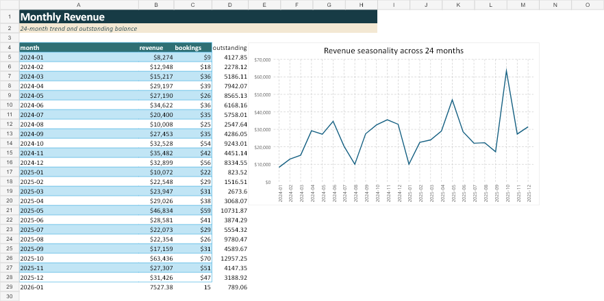
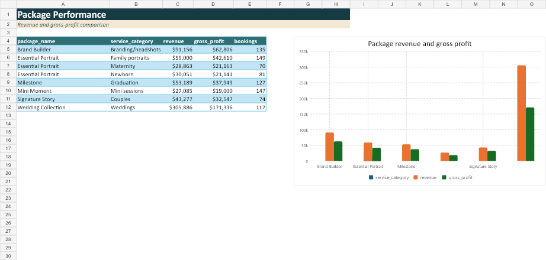
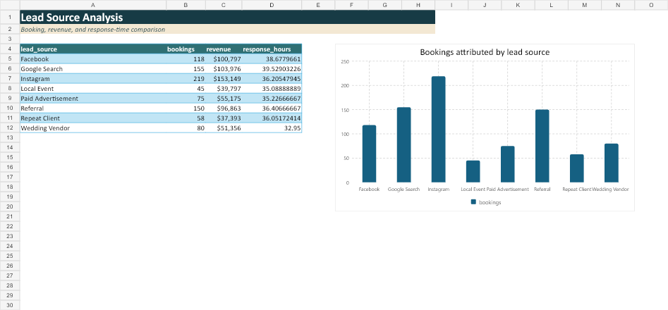

# Photography Business Analytics & Operations Dashboard

### Turning disconnected booking, marketing, and payment records into a decision-ready reporting system

[](python/)
[](sql/)
[](r/photography_business_findings.Rmd)
[](powerbi/WildlightAnalytics.pbip)
[](tableau/Wildlight_Analytics.twbx)
[](excel/photography_business_analysis.xlsx)

> **This independent portfolio project uses entirely synthetic data. It was created to demonstrate analytical, technical, documentation, and process-improvement skills commonly used in small-business analytics. It does not contain data from any real employer, client, or individual.**

## Project at a glance

Wildlight Portrait Studio is a fictional photography business whose lead, booking, session, payment, and expense records were spread across disconnected files. The goal was to create one reliable reporting system that could answer four practical questions:

- Where is revenue and profit coming from?
- Which marketing channels produce valuable bookings?
- Where are clients dropping out or leaving balances unpaid?
- Which workflow improvements could reduce administrative effort?

I designed the synthetic data, introduced realistic quality problems, built a repeatable cleaning and validation pipeline, modeled the business in SQL, analyzed it in Python and R, and translated the results into Excel, Power BI, and Tableau deliverables.


## Executive findings

| Business measure | Result | Why it matters |
|---|---:|---|
| Cash revenue | **$638,507** | Establishes the revenue baseline for the two-year synthetic period |
| Gross profit | **$460,887** | Indicates strong modeled contribution after operating expenses |
| Profit margin | **72.2%** | Supports package and service profitability comparisons |
| Average booking value | **$857** | Provides a benchmark for pricing and sales-mix decisions |
| Lead-to-booking conversion | **50.0%** | Measures how efficiently inquiries become bookings |
| Repeat-client rate | **33.1%** | Shows meaningful retention opportunity |
| Cancellation / rescheduling | **7.7% / 8.9%** | Identifies avoidable operational friction |
| Outstanding balance | **$132,583** | Highlights the need for stronger payment follow-up |
| Average first response | **36.7 hours** | Suggests that a one-business-day response target could help |
| Session completion rate | **78.0%** | Surfaces booking-to-session workflow exceptions |

### What the analysis suggests

- **Wedding Collection is the strongest package**, generating approximately $306K in revenue and $171K in modeled gross profit.
- **Instagram generates the most attributed bookings and revenue**, with Google Search and Referral forming the next-highest-volume group.
- **Demand is seasonal.** October–November family and mini sessions and April–May graduation demand create clear capacity-planning windows; January is consistently softer.
- **Operational follow-up is the clearest improvement opportunity.** Slow first responses, partial payments, reschedules, and incomplete session records create avoidable administrative work.
- A fictional studio could test a **24-business-hour response SLA, required deposits, automated reminders, and daily exception queues** before investing in additional lead volume.

These findings describe a synthetic scenario. They are analytical recommendations, not claims about changes implemented by a real organization.

## Deliverables

| Deliverable | What it contains | Open it |
|---|---|---|
| Power BI project | Five pages, canonical DAX measures, KPI cards, revenue trend, and package, marketing, client, and payment visuals | [`WildlightAnalytics.pbip`](powerbi/WildlightAnalytics.pbip) |
| Tableau workbook | Packaged data, four analytical worksheets, calculated fields, and an executive dashboard | [`Wildlight_Analytics.twbx`](tableau/Wildlight_Analytics.twbx) |
| Excel workbook | Nine formatted sheets, filters, KPI summaries, conditional formatting, exception reporting, and native charts | [`photography_business_analysis.xlsx`](excel/photography_business_analysis.xlsx) |
| R Markdown report | Reproducible calculations, six graphics, interpretation, recommendations, and limitations | [`HTML report`](r/photography_business_findings.html) · [`Rmd source`](r/photography_business_findings.Rmd) |
| SQL analysis | Normalized schema, constraints, quality checks, business queries, CTEs, windows, and reusable views | [`sql/`](sql/) |
| Project documentation | Charter, requirements, stakeholder matrix, risks, data dictionary, process plan, and lessons learned | [`project_plan/`](project_plan/) |

## From raw files to recommendations

```text
Synthetic source data
        ↓
Data-quality profiling and cleaning
        ↓
Normalized SQLite model + booking-level analytics table
        ↓
SQL, Python, and R analysis
        ↓
Excel, Power BI, Tableau, and R Markdown reporting
        ↓
Executive findings and process-improvement recommendations
```

### 1. Build realistic synthetic data

The generator creates two years of activity across clients, leads, bookings, sessions, packages, payments, and expenses. Seasonality reflects common portrait-business patterns such as graduation demand, holiday family sessions, wedding seasons, mini-session promotions, and softer January demand.

### 2. Detect and resolve data-quality issues

The raw files deliberately include duplicate clients, missing phone numbers, invalid emails, inconsistent date formats, source-name misspellings, blank package labels, negative payments, partial payments, cancellations, reschedules, late payments, and bookings without completed sessions.

The cleaning pipeline standardizes valid values while retaining legitimate business exceptions for analysis. A machine-readable quality report records the corrections made.

### 3. Define one source of truth

The normalized SQLite design separates clients, leads, bookings, sessions, packages, payments, and expenses. A booking-grain analytics table then provides consistent definitions for revenue, gross profit, balances, response time, inquiry-to-booking time, and completion status.

### 4. Analyze and communicate

- **SQL** answers operational and financial questions with joins, aggregations, CTEs, window functions, date logic, and reusable views.
- **Python** runs the core pipeline, produces charts and dashboard extracts, and generates a simple seasonal-trend forecast.
- **R** independently validates the analysis and presents findings through a reproducible R Markdown report.
- **Excel, Power BI, and Tableau** translate the same canonical metrics into stakeholder-friendly reporting tools.

## Dashboard views

### Revenue seasonality



### Package performance



### Marketing-source performance



## Repository structure

```text
photography-business-analytics/
├── data/           Synthetic raw data, cleaned data, and dashboard extracts
├── sql/            Schema, quality checks, business queries, and views
├── python/         Generation, cleaning, analysis, forecasting, and exports
├── r/              R analysis plus rendered R Markdown findings report
├── excel/          Executive analysis workbook
├── powerbi/        Validated PBIP/PBIR/TMDL project and DAX documentation
├── tableau/        Packaged Tableau workbook and build documentation
├── project_plan/   Charter, requirements, stakeholders, risks, and dictionary
├── reports/        Executive summary, findings, and recommendations
├── visuals/        Dashboard and analytical previews
└── tests/          Data-generation, cleaning, and KPI checks
```

## Run the project

```powershell
git clone https://github.com/andersjewel/photography-business-analytics.git
cd photography-business-analytics

python -m venv .venv
.\.venv\Scripts\Activate.ps1
python -m pip install -r requirements.txt

python data\synthetic_data_generation\generate_data.py
python python\data_cleaning.py
python python\business_analysis.py
python python\exploratory_analysis.py
python python\forecasting.py
python python\export_dashboard_data.py
python -m pytest -q
```

The Excel workbook and rendered R report can be reviewed without running code. Power BI Desktop is required for the `.pbip` project; Tableau Desktop or Tableau Public can open the packaged `.twbx` workbook.

## Skills demonstrated

`Data cleaning` · `SQL` · `Python` · `R` · `Excel` · `Power BI` · `Tableau` · `SQLite` · `Data modeling` · `KPI design` · `Forecasting` · `Business analysis` · `Process improvement` · `Requirements gathering` · `Project coordination` · `Executive communication`

## Limitations and next steps

- The data is synthetic and uses simplified, single-touch marketing attribution.
- Package variable costs are suitable for comparative analysis but do not represent complete job costing.
- Two years of history support a directional forecast, not a high-confidence production model.
- A future version could add campaign spend, labor hours, payment fees, capacity constraints, reason codes, multi-touch attribution, and automated dashboard refreshes.

---

**Independent portfolio case study by [Anders Jewel](https://github.com/andersjewel).**
